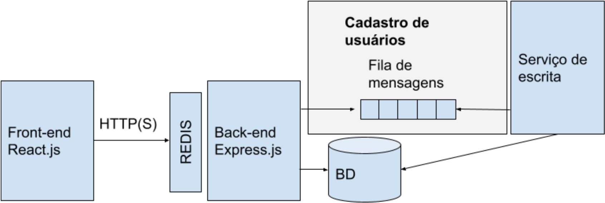

# Projeto Suficiência Web

Project made as a sufficiency assessment for the full-stack web programming course (AS64A).

## Features

- User registration
- User login
- User search
- Only users with an active session in the system (logged in) can register new users and perform a user search.

## System Architecture 

The system should be implemented with 4 layers, as illustrated in Figure 1. The technical requirements are detailed below, considering each layer of the system: 

**Front-end:** must be implemented using the React.js front-end library. All communication with the  Back-end must be carried out through HTTP requests, characterizing a Single-Page Application - SPA; 

**Back-end:** must be implemented using Express.js. Communication with the Front-end must follow the Restful route pattern. This server will have direct read-only access to the database. The writing processes must be carried out through the writing service in the database. This server must also implement a route cache system, using the REDIS system;

**Writing service:** it must be implemented with Node.js, it will have direct access to the database, and the communication with the other services must be carried out through a message queue system or event flow;

**Database:** any database management system chosen by the students can be used.



## Tech Stack

**Client:** React, Vite, CSS Modules

**Server:** Node, Express, Redis, RabbitMQ, MongoDB

## Run Locally

Clone the project

```bash
  git clone git@github.com:RenatoMoratto/projeto-suficiencia-web.git
```

Go to the project directory

```bash
  cd projeto-suficiencia-web
```

Create the `.env` file or copy the `.env.example`

```bash
  cp .env.example .env
```

Run the project using the `app` bash script

```bash
  bash app.sh run
```

## Environment Variables

To run this project, you will need to add the following environment variables to your .env file.

The `.env.example` file contains an example of how each variable should be

#### MongoDB

`DB_ROOT_USER`
`DB_ROOT_PASS`
`DB_WRITE_USER`
`DB_WRITE_PASS`
`DB_READ_USER`
`DB_READ_PASS`
`DB_NAME`
`DB_LOCAL_PORT`
`DB_DOCKER_PORT`

#### Redis

`REDIS_HOST`
`REDIS_PORT`

#### NodeJS Api

`API_LOCAL_PORT`
`API_DOCKER_PORT`
`JWT_SECRET`

#### React

`CLIENT_API_BASE_URL`
`UI_LOCAL_PORT`
`UI_DOCKER_PORT`

#### RabbitMQ

`DEFAULT_USER`
`QUEUE_LOCAL_PORT`
`QUEUE_DOCKER_PORT`
`MQ_HOST`
`MQ_PORT`
`MQ_UI_PORT`
`MQ_USER`
`MQ_PASS`

## Authors

-   [@RenatoMorato](https://github.com/RenatoMoratto)
